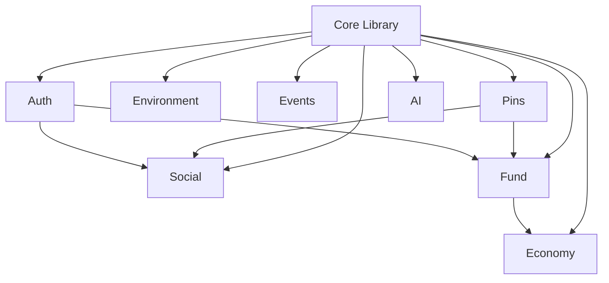

# SILAS Modules Overview

Each module represents a core system of the SILAS platform with clear boundaries and responsibilities.

## 🏗️ Module Architecture

Each module follows a consistent structure:
- `/components` - React components specific to the module
- `/hooks` - Custom React hooks for the module
- `/services` - API services and external integrations
- `/types` - TypeScript type definitions
- `/pages` - Page components for routing
- `/utils` - Module-specific utility functions
- `index.ts` - Barrel export for clean imports
- `README.md` - Module documentation

## 📦 Available Modules

| Module | Description | Status | Owner |
|--------|-------------|--------|-------|
| **Pins** | Map pins, clustering, and pin management | ✅ Complete | Core Team |
| **Social** | Comments, reactions, shares, and social feeds | ✅ Complete | Core Team |
| **Fund** | Community fund, proposals, and Stripe integration | ✅ Complete | Core Team |
| **Economy** | Local business, marketplace, and commerce | 🚧 In Progress | Dev Team |
| **Environment** | Environmental tracking and sustainability | 📋 Planned | Dev Team |
| **Events** | Community events and scheduling | 📋 Planned | Dev Team |
| **Auth** | Authentication and user management | 📋 Planned | Dev Team |
| **AI** | AI copilot and knowledge management | 🚧 In Progress | Core Team |

## 🔗 Module Dependencies



## 🧩 Usage Examples

### Importing from Modules

```tsx
// Clean barrel imports
import { PinCard, usePins } from '@/modules/pins';
import { CommentList, useComments } from '@/modules/social';
import { FundDashboard, useFundBalance } from '@/modules/fund';
import { Button, Modal } from '@/core';
```

### Cross-Module Communication

Modules communicate through:
1. **Supabase database** - Shared data layer
2. **Global state** - For UI state (theme, auth, etc.)
3. **Events** - For loose coupling between modules
4. **Shared types** - From core library

### Adding New Modules

1. Create module folder: `/src/modules/new-module/`
2. Follow the standard structure
3. Create `README.md` with module purpose
4. Add barrel export in `index.ts`
5. Update this overview README
6. Add to routing if needed

## 🧪 Testing Strategy

Each module includes:
- **Unit tests** for components and hooks
- **Integration tests** for API services
- **E2E tests** for critical user flows
- **Storybook stories** for component documentation

## 🚀 Development Workflow

1. **Feature branches** per module: `feature/pins-clustering`
2. **Module ownership** - Each module has a lead developer
3. **Independent deployment** - Modules can be developed in parallel
4. **Shared standards** - ESLint, Prettier, TypeScript configs
5. **Code reviews** - Cross-module reviews for shared interfaces

## 📊 Module Metrics

Track module health with:
- Test coverage per module
- Bundle size impact
- Performance metrics
- API response times
- User engagement per feature

## 🔧 Configuration

Module-specific configuration should be:
- Environment variables prefixed with module name
- Centralized in module's config file
- Documented in module README
- Validated at startup

## 🌐 Routing Structure

```
/                    → Home page
/map                 → Main map view
/pins/*              → Pin management routes
/social/*            → Social features
/fund/*              → Community fund
/economy/*           → Local business
/environment/*       → Environmental features
/events/*            → Community events
/profile/*           → User profile
```

## 📚 Documentation

Each module maintains:
- API documentation
- Component documentation (Storybook)
- Usage examples
- Migration guides
- Troubleshooting guides

## 🔄 Migration from Monolith

The modular architecture was created by:
1. Identifying domain boundaries
2. Extracting shared code to core library
3. Creating module-specific APIs
4. Implementing barrel exports
5. Setting up module routing
6. Adding comprehensive testing

This ensures clean separation of concerns while maintaining the existing functionality.
